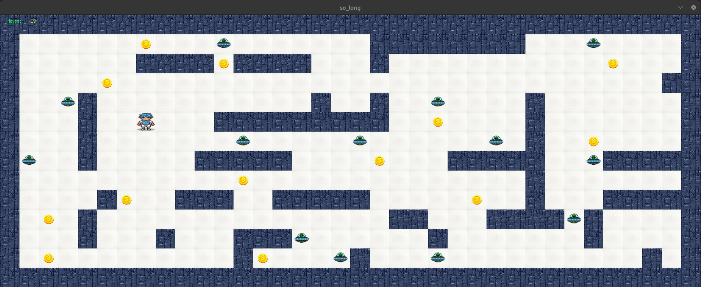

# so_long

> A simple 2D graphical game written in C using the MiniLibX library, developed as part of the 42 School curriculum.

## Table of Contents

- [About](#about)
- [Features](#features)
- [Getting Started](#getting-started)
- [How to Play](#how-to-play)
- [Controls](#controls)
- [Map Rules](#map-rules)
- [Screenshots](#screenshots)
- [Bonus](#bonus)
- [Credits](#credits)

---

## About

**so_long** is a small 2D game where the player navigates a map, collects all collectibles, and reaches the exit. The map is read from a file, and the game features basic graphics and keyboard input using the MiniLibX library.

This project is part of the 42 curriculum and aims to introduce students to graphical applications and event-driven programming in C.

## Features

- Read and parse a map from a `.ber` file
- Render a 2D grid-based map using images for walls, floor, player, collectibles, and exit
- Player movement using keyboard input (WASD or arrow keys)
- Collectibles that must all be picked up before exiting
- Move counter displayed on screen or terminal
- Error handling for invalid maps
- Window closes on pressing ESC or clicking the close button

## Getting Started

### Prerequisites

- macOS or Linux
- `gcc` compiler
- MiniLibX library (provided by 42 or install manually)

### Clone the repository

```bash
git clone https://github.com/your-username/so_long.git
cd so_long
```

### Build

```bash
make
```

### Run

```bash
./so_long maps/example.ber
```

## How to Play

1. Launch the game with a valid map file:
    ```
    ./so_long maps/your_map.ber
    ```
2. Move the player using **WASD** or **arrow keys**.
3. Collect all the collectibles (`C`) on the map.
4. Reach the exit (`E`) to win, but only after collecting all collectibles.
5. Avoid walking through walls (`1`).

## Controls

- **W / Up Arrow**: Move up
- **A / Left Arrow**: Move left
- **S / Down Arrow**: Move down
- **D / Right Arrow**: Move right
- **ESC**: Exit game

## Map Rules

- Map must be rectangular (all lines same length)
- Surrounded by walls (`1`)
- Must contain:
  - One player (`P`)
  - At least one exit (`E`)
  - At least one collectible (`C`)
- Only valid characters: `01PEC` `N` for enemy
- Example:

    ```
    111111
    1P0C01
    100001
    1C0E11
    111111
    ```

## Screenshots



## Bonus

- include player animation and enemy attacks
    - player move `up` `down` `left` `right` with the right movements
    - enemy movers random but without animation  like the player

## Credits

- Developed by [Abdellah syani] as part of 42 School
- Thanks to 42 Network and MiniLibX contributors

---

**Enjoy the game!**
